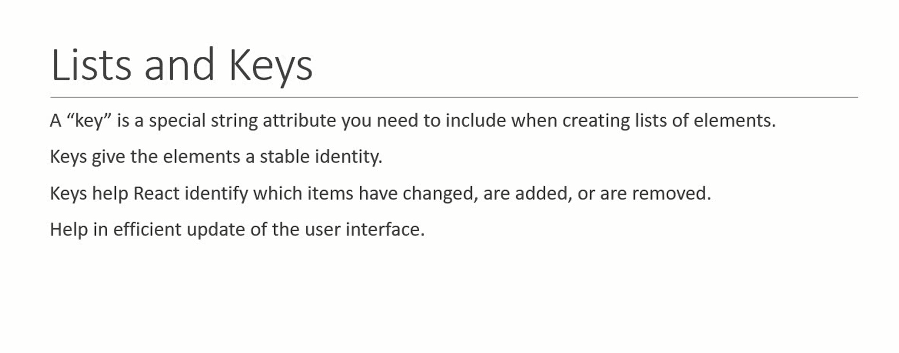
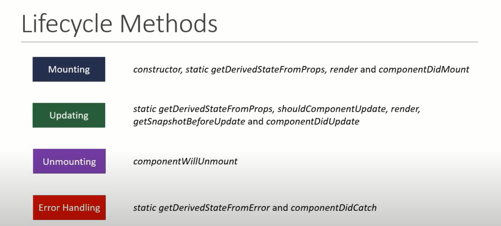
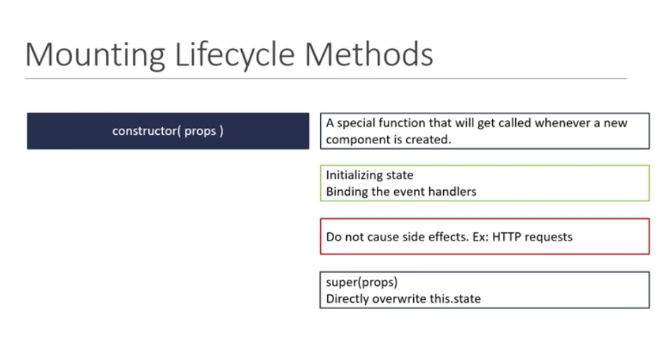
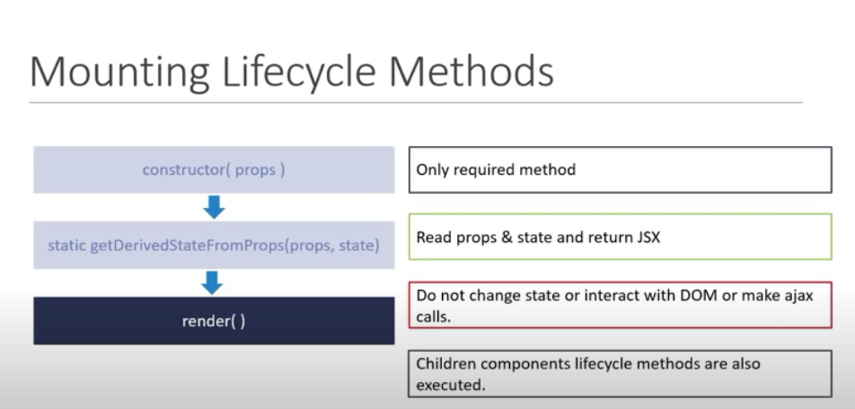
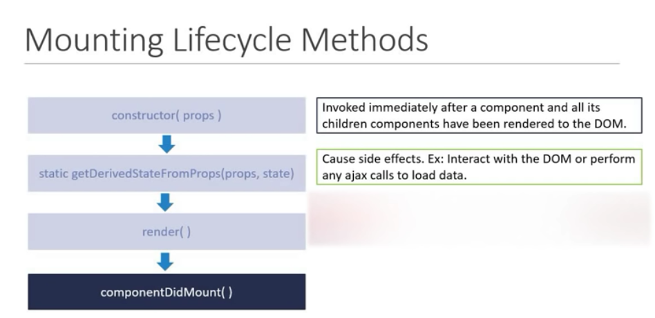
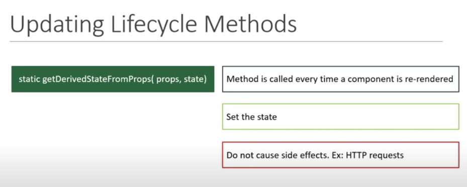
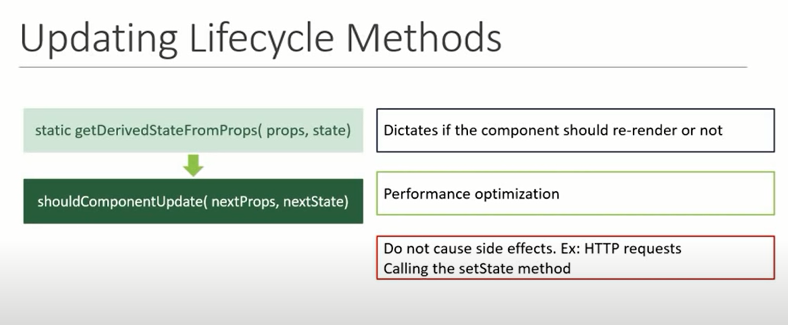
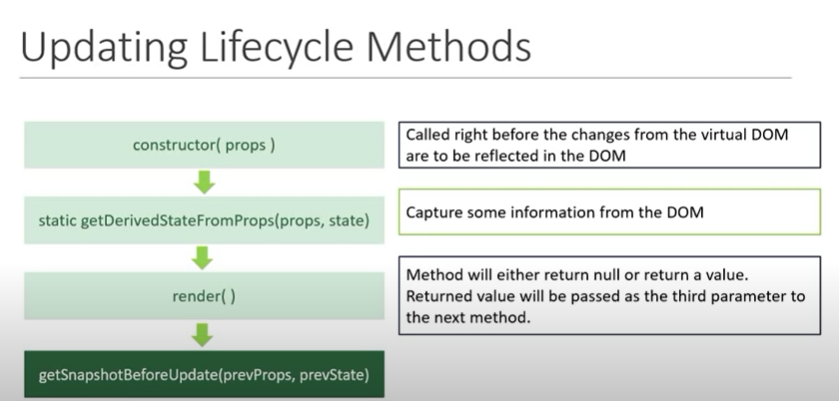
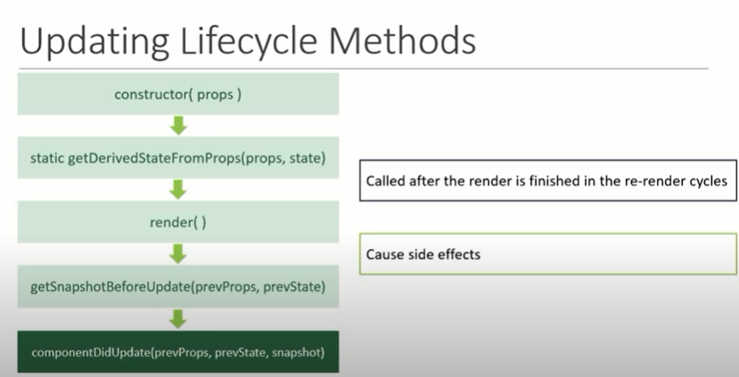
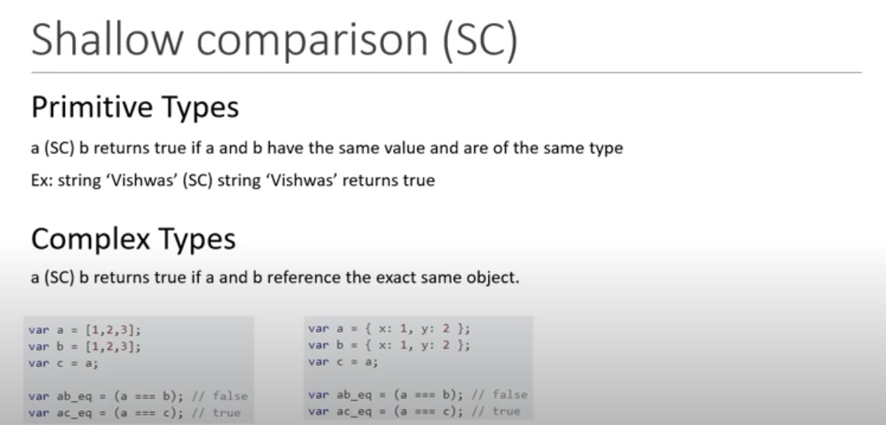

# ReactJS

React is **JavaScript library** for building rich user-interfaces.
React runs on client as a single page application (SPA). That is `public -> index.html`.


React is referred to as a front-end framework as it is comparable to frameworks like Angular or Vue.


Angular has a built in routing system and react doesn't but could be installed "react-router-dom". It has it own ecosystem of packages to make it a full-fledged framework.

# React Fundamentals

- [package.json]()
- [Why use React]()
- [JSX: JavaScript XML]()
- [props & State]()
- [Functional and Class Components]()
- [Styling React Components]()
- [Lifecycle Methods]()

<hr>

## package.json

It is a manifest file that has information about our app like the dependencies/packages that are being used.
```javascript
{
    "dependencies": {
        "react": "^17.0.1", // the library itself
        "react-dom": "^17.0.1", // deals with loading components in the browser, alternative to this is react-native for mobile
        "react-scripts": "4.0.2", // dev server, compile our apps, test 
    },

    "scripts": {
        "start": "react-scripts start" , // start dev server, offers hot-reload 
        "build": "react-scripts build", // compiling before deploying, npm run build
        "test": "react-scripts test",
        "eject": "react-scripts eject" // customize webpack file 
    }
}
```
<hr>

## Why use React?

- React structures the "View" layer in MVC design pattern. Model deals with the data and Controller deals with the requests & routing.
- Component based Architecture: Reusable components with their own state, making a dynamic site using vanilla JS could get really messy and hard to maintain in a team.
- JSX: JavaScript Syntax Extension (Dynamic Markup): this allows to write dynamic html.
- Interactive UI since it uses Virtual DOM(Document Object Model). Updates a part of the page without reloading the entire page.
- It structures the code base which make it easier to work in teams.
- Data binding and immutable state, improves performanace and helps in debugging.

`src -> index.js` is the entry point to react. 

`import App from './App';` : App component that wraps around the entire application.

```javascript
ReactDOM.render(
  <React.StrictMode>
    <App />
  </React.StrictMode>,
  document.getElementById('root')
);
```

Rendering `App` component `src -> App.js` into the element with `id=root` from `public -> index.html`. Glocal CSS file is `src -> App.css`.

Inside the `App.js` we have a render method (life-cycle method), only method that is required to render components in the browser which returns JSX. 
In JSX, instead of `<div class="name"></div>` we would be writing `<div className="name"></div>`.

<hr>

## JSX: JavaScript XML

- Produces React "elements".
- JSX is an extension of the JavaScript language syntax based on ES6, and is translated into regular JavaScript at runtime.

- We `import React from 'react';` on every component as `React.createElement` is used for JSX.

```javascript
const name = 'Josh Perez';
const element = <h1>Hello, {name}</h1>;

ReactDOM.render(
  element,
  document.getElementById('root')
);
```

- JSX needs to have only one top parent tag `<div>` enclosing everything. It cannot hold 2 top parent or siblings. Only one Root JSX Element returned by Component.

- JSX follows XML rules, and therefore HTML elements must be properly closed.

- JSX converts HTML tags into react elements. 

- JSX elements are JS Objects.

- For multiline make use of parantheses ().

- JSX elements are not strings and cannot concatenate but we can put them in array.


- JSX allows us to write HTML elements in JavaScript and place them in the DOM without any `createElement()`  and/or `appendChild()` methods.

### Specifying Attributes with JSX

> Since JSX is closer to JavaScript than to HTML, React DOM uses camelCase property naming convention instead of HTML attribute names.
For example, `class` becomes `className` in JSX, and `tabindex` becomes `tabIndex`.

<hr>

## props

- `propTypes` does type validation of value in props of a component. We can also specify whether the prop is required or not and based on these warnings are raised. Considered "Good Practice".
   - From React 15.5 `prop-types` need to be installed via NPM `npm i prop-types`. 

- Default props: We can specify default values for a component using `defaultProps`. If we specify props then this will overwrite the default prop values.

- props are passed from outside.
- props are read-only. And hence, props are immutable that is their values cannot be changed.

## State
```javascript
// `this.state` is used to make a object and is understood by React as state 
this.state = {
  message: 'This is a message'
}

// on some event we can change the state using setState

function onEvent() {
  this.setState = {
    message: 'This is new message'
  }
}

render() {
  return (
    <h3>{ this.state.message }</h3>
    //  here we use an arrow function run the method only when it is clicked, not while rendering
    <button onClick = { () => this.onEvent() }>Click</button>
  )
}
```
- State is nothing but an object that is privately maintained inside a component. 
- State can influence what is rendered in the browser. 
- State can be changed within the component.


- If we redefine/reassign values to `this.state` object, it will change the value but won't re-render the component. To re-render the component with updated value, one must use `.setState` method and redefine the `this.state` object. That's why we shouldn't modify the `state` directly. `this.state` must be in the constructor and whenever we will need to update the value, `setState()` method has to be used. Call to `setState()` is asynchronous. `setState()` method accepts two parameters, one is state object and another is a callback function.
- Make use of callback function of `setState` method to execute anything that needs to run after the re-rendering the component. If not done as a callback fuction, the code after `setState` may run before the state is set as `setState` is a asynchronous method.
- React may group multiple `setState` calls into a single update for better performance. To get around this behaviour instead of reassigning the value of current `this.state` object in `setState` directly, like we would have done previously, we would make use of `prevState` or pass in a function as an argument instead of the regular object.

- [Understanding React setState - Medium Article](https://medium.com/@baphemot/understanding-reactjs-setstate-a4640451865b)

```javascript
functionCall () {
  this.setState(prevState => { // prevState is just holding the currentValues of state object 
    count: prevState.count + 1
  })
}
```

- `setState` accepts a function as its parameter. If you pass a function as the first argument of setState, React will call it with the at-call-time-current state and expect you to return an Object to merge into state. So updating our example above to:
```javascript
// assuming this.state = { value: 0 };
this.setState((state) => ({ value: state.value + 1}));
this.setState((state) => ({ value: state.value + 1}));
this.setState((state) => ({ value: state.value + 1}));
```
Will give us `this.state.value = 3` like we expected in the first place. Remember to always use this syntax when updating state to a value, which is computed based on previous state!

## `props` vs `state`


Both props and state hold information that influences the UI in the browser.


### Downward and Upward Data Flow : TO_DO

<hr>

## Functional Components & Class Components
Components describe a part of user interface.


Rendering logic coupled with other UI logic. Markup and logic in same file, react [separates concerns](https://en.wikipedia.org/wiki/Separation_of_concerns) with loosely coupled units called "components".


Components are independent and reusable bits of code.

<hr>

### Functional Components

- We can use functional component to directly render JSX in DOM.
- We can pass `props` as an argument to the function and reuse the component by changing the attributes.
- `props` is a JavaScript Object that stores the attributes of the component to be used.
- Used for UI purpose.


<hr>

### Class Components

- We will need to import {Component} from 'react' or make use of React.Component class and use a render() method to return JSX to render it in DOM. 

- Example:

```javascript
class ClassComponent extends Component {

  constructor(props) {
    super();
  }
  render() {
    return (
      <div>
        <h1>This is a {this.prop.type} based Component.</h1>
      </div>
    )
  }
}

<ClassComponent type="Class"/>
```

- To pass `props` in class based component we will have to use a `constructor`. To use `props` we have to make note of the context by using `this`. 

- Apart from `props` class component can maintain a private internal `state`.
- Preferable when logic is quite complex.
<hr>

### Functional vs Class Component


> Note since, React 16.8, hook lets you use state and other React features without writing a class. Click [here](https://reactjs.org/docs/hooks-intro.html) to learn more.

<hr>

## Rendering Elements

- While rendering a list of items in DOM using react, one needs pass unique key associated with the value while rendering. Here is why,



Having a unique key associated with each value helps react update only that part of the compoment instead of re-rendering the entire list component. This improves performance.

<hr>

## Styling React Components

1. CSS Stylesheet: Applied to the children component
2. Inline Stylesheet
3. CSS Module: Cannot be used in the children component. Cannot be used in other component by mistake.
4. CSS in JS Libraries (Styled Components)

<hr>

## Controlled Components

The form elements controlled by React is called a controlled component. 

<hr>

## Lifecycle Methods

A react component goes through several stages in its lifecycle. There are built-in methods to override lifecycle. Exists only in class components.


Here are the methods in each lifecycle stage of a class based component.



1. **Mounting**: When instance of a component is being created and insert into the DOM.
  - `constructor()`:
  
  - `static getDerivedStatefromProps(props, state)`: When the state of a component depends on changes in props over time. Set the state by returning the new state object not similar to `this.setState()`.
  - `render()`:
  
  - `componentDidMount()`: Called only once in a component's lifecycle.
  
2. **Updating**: When the component is being re-rendered as a result of changes to either its props or state.
  - `static getDerivedStateFromProps(props, state)`:
  
  - `shouldComponentUpdate(nextProps, nextState)`:
  Compare the existing state and props values with next Props and state values and return `True` or `False` to let react know if the component should update or not.
  
  - `render()`: Same as above.
  - `getSnapshotBeforeUpdate(prevProps, prevState)`:
   
  - `componentDidUpdate(prevProps, prevState, snapshot)`: Can make AJAX calls but needs to compare previous state, props with next state, props. It is called once after the component re-renders.
  
3. **Unmounting**: When the component is being removed from the DOM.
  - `componentWillUnmount()`: Method is invoked immediately before a component is unmounted and destroyed. 
    - Can perform some cleanup tasks like cancelling any network requests, removing event handlers, cancelling any subscriptions and also invalidating timers.
    - Do not call the `setState` method. Never re-renders after the component is unmounted.
4. **Error handling**: When there is an error during rendering, in a lifecycle method, or in constructor of any child component. Will be discussed during Error boundaries in React.
  - `static getDerivedStateFromError(error)`
  - `componentDidCatch(error, info)`

<hr>

# React Advance

## Fragments

A common pattern in React is for a component to return multiple elements. Fragments let you group a list of children without adding extra nodes to the DOM.
Only key attribute can be passed in `React.Fragment`. We can also use just `<> JSX </>` but with limitation that we won't be able to specify `key` attribute.

## Pure Component

Works only on class based components.


A pure component implements `shouldComponentUpdate` with a shallow prop and state comparison. Prevents unnecessary re-renders gives performance boost in certain scenarios



Re-renders the component only when there is difference in

- SC of prevState with currenState
- SC of prevProps with currentProps

If there is no difference, the component is not re-rendered thereby providing a performance boost.


Never mutate the state. Always return a new object that reflects the new state.

## React.memo

This is a [higher order component](https://reactjs.org/docs/higher-order-components.html). Introduced in React v16.6.
- Same as above "Pure Component" but for functional components.
- Accepts component, add some things to the component and returns a new enhanced component. `export default React.memo(ComponentName)`

## Refs

Makes it possible to access DOM nodes directly within React.
- Attach a `ref` attribute to the element, 
`<input type = "text" ref = {this.focusUsername} />`
- Define the same in the component constructor.
`this.focusUsername = React.createRef()`
- Now set the property within mounting lifecycle method didComponentMount: 
`this.focusUsername.current.focus()`

> Same can be achieved using callback Refs.

- Refs cannot be attached to functional components.

- Refs from parent to child is achievable using class components. [Click here](https://www.youtube.com/watch?v=8aCXVC9Qmto&list=PLC3y8-rFHvwgg3vaYJgHGnModB54rxOk3&index=29)

### Forwarding Refs

A technique to automatically pass a ref through a component to one of its children.
Using of `React.forwardRef`. Used in some library or higher order components.


## Portals

- Provide a way to render children into a DOM node that exists outside the DOM hierarchy of the parent component. 
- Ability to breakout of `id = "root"` DOM tree.
- The first parameter to `React.createPortal` can be any element that react can render, can be number, strings, JSX and even components.

### Why use Portals?

- Having to deal with parent component CSS, when the child component is a modal, popup or a tooltip.
- Event fired from inside a portal, propagates to ancestors in containing react tree, event bubbling still works.
- Portal behaves like a normal react child in every other way.

## Error Boundary

Error boundaries are React components that catch JavaScript error in their child component tree, log those errors and displays a fallback UI.


A class component that implements either one or both of the lifecycle methods `getDerivedStateFromError` or `componentDidCatch` becomes an **error boundary**.
Catch the errors anywhere in component tree and display a fallback UI.

- `static getDerivedStateFromError` is used to render a fallback UI after an error is thrown.

- `componentDidCatch` is used to log the error information.

Provide a way to gracefully handle error in application code.

- The placement of the Error Boundary also matter as it controls if the entire app should have the fallback UI or just the component causing the problem.

- Error boundary catch errors during rendering in lifecycle methods and in the constructors of the whole tree below them. Do not catch error inside event handlers.
On using something like `onClick`, we will have to use `try-catch` not error boundary.

# Useful articles & videos I came across

- [Fetching Data in React](https://blog.bitsrc.io/fetching-data-in-react-using-hooks-c6fdd71cb24a)
- [Youtube: Axios with React](https://www.youtube.com/watch?v=oQnojIyTXb8)

