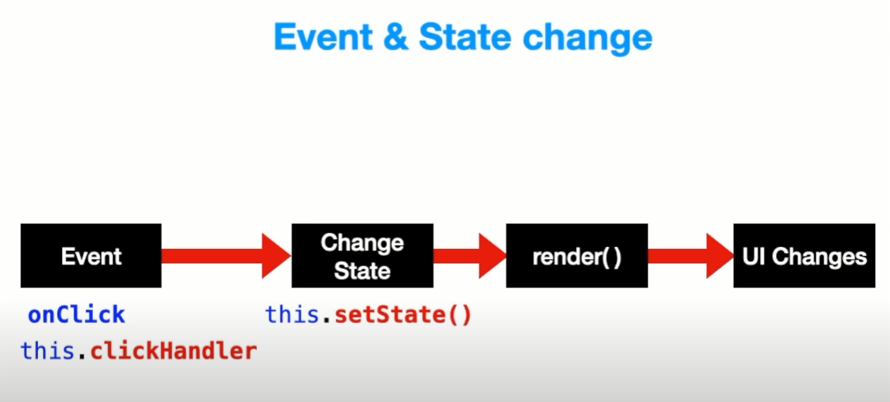
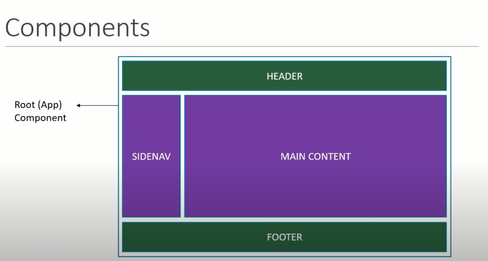
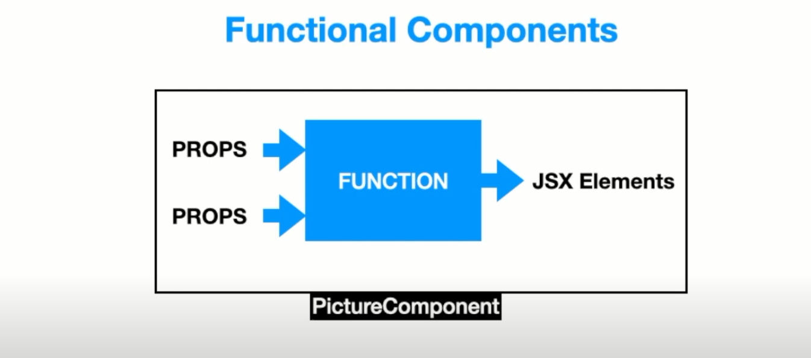
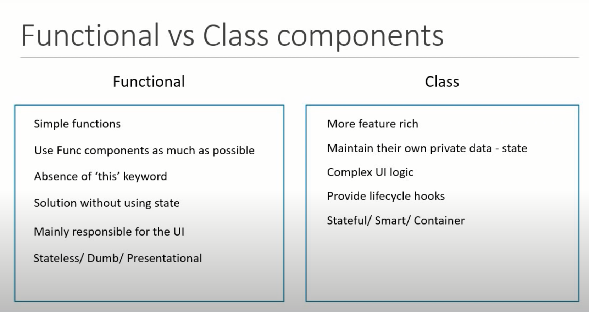

# ReactJS

React is **JavaScript library** for building rich user-interfaces.
React runs on client as a single page application (SPA). That is `public -> index.html`.


React is referred to as a front-end framework as it is comparable to frameworks like Angular or Vue.


Angular has a built in routing system and react doesn't but could be installed "react-router-dom". It has it own ecosystem of packages to make it a full-fledged framework.

## Why use React?

- React structures the "View" layer in MVC design pattern. Model deals with the data and Controller deals with the requests & routing.
- Component based Architecture: Reusable components with their own state, making a dynamic site using vanilla JS could get really messy and hard to maintain in a team.
- JSX: JavaScript Syntax Extension (Dynamic Markup): this allows to write dynamic html.
- Interactive UI since it uses Virtual DOM(Document Object Model). Updates a part of the page without reloading the entire page.
- It structures the code base which make it easier to work in teams.
- Data binding and immutable state, improves performanace and helps in debugging.

`src -> index.js` is the entry point to react. 

`import App from './App';` : App component that wraps around the entire application.

```javascript
ReactDOM.render(
  <React.StrictMode>
    <App />
  </React.StrictMode>,
  document.getElementById('root')
);
```

Rendering `App` component `src -> App.js` into the element with `id=root` from `public -> index.html`. Glocal CSS file is `src -> App.css`.

Inside the `App.js` we have a render method (life-cycle method), only method that is required to render components in the browser which returns JSX. 
In JSX, instead of `<div class="name"></div>` we would be writing `<div className="name"></div>`.


## JSX: JavaScript XML

- Produces React "elements".
- JSX is an extension of the JavaScript language syntax based on ES6, and is translated into regular JavaScript at runtime.

- We `import React from 'react';` on every component as `React.createElement` is used for JSX.

```javascript
const name = 'Josh Perez';
const element = <h1>Hello, {name}</h1>;

ReactDOM.render(
  element,
  document.getElementById('root')
);
```

- JSX needs to have only one top parent tag `<div>` enclosing everything. It cannot hold 2 top parent or siblings. Only one Root JSX Element returned by Component.

- JSX follows XML rules, and therefore HTML elements must be properly closed.

- JSX converts HTML tags into react elements. 

- JSX elements are JS Objects.

- For multiline make use of parantheses ().

- JSX elements are not strings and cannot concatenate but we can put them in array.


- JSX allows us to write HTML elements in JavaScript and place them in the DOM without any `createElement()`  and/or `appendChild()` methods.

### Specifying Attributes with JSX

> Since JSX is closer to JavaScript than to HTML, React DOM uses camelCase property naming convention instead of HTML attribute names.
For example, `class` becomes `className` in JSX, and `tabindex` becomes `tabIndex`.

## props

- `propTypes` does type validation of value in props of a component. We can also specify whether the prop is required or not and based on these warnings are raised. Considered "Good Practice".
   - From React 15.5 `prop-types` need to be installed via NPM `npm i prop-types`. 

- Default props: We can specify default values for a component using `defaultProps`. If we specify props then this will overwrite the default prop values.

- props are passed from outside.
- props are read-only. And hence, props are immutable that is their values cannot be changed.

## State
```javascript
// `this.state` is used to make a object and is understood by React as state 
this.state = {
  message: 'This is a message'
}

// on some event we can change the state using setState

function onEvent() {
  this.setState = {
    message: 'This is new message'
  }
}

render() {
  return (
    <h3>{ this.state.message }</h3>
    //  here we use an arrow function run the method only when it is clicked, not while rendering
    <button onClick = { () => this.onEvent() }>Click</button>
  )
}
```
- State is nothing but an object that is privately maintained inside a component. 
- State can influence what is rendered in the browser. 
- State can be changed within the component.



## `props` vs `state`


Both props and state hold information that influences the UI in the browser.


### Downward and Upward Data Flow : TO_DO

## package.json

It is a manifest file that has information about our app like the dependencies/packages that are being used.
```json
{
    "dependencies": {
        "react": "^17.0.1", /* the library itself */
        "react-dom": "^17.0.1", /* deals with loading components in the browser, alrenative to this there is react-native for mobile */
        "react-scripts": "4.0.2", /* dev server, compile our apps, test */
    },

    "scripts": {
        "start": "react-scripts start" , /* start dev server, offers hot-reload */
        "build": "react-scripts build", /* compiling before deploying, npm run build */
        "test": "react-scripts test",
        "eject": "react-scripts eject" /* customize webpack file */
    }
}
```

## Functional Components & Class Components
Components describe a part of user interface.




Rendering logic coupled with other UI logic. Markup and logic in same file, react [separates concerns](https://en.wikipedia.org/wiki/Separation_of_concerns) with loosely coupled units called "components".


Components are independent and reusable bits of code.


### Functional Components

- We can use functional component to directly render JSX in DOM.
- We can pass `props` as an argument to the function and reuse the component by changing the attributes.
- `props` is a JavaScript Object that stores the attributes of the component to be used.
- Used for UI purpose.



### Class Components

- We will need to import {Component} from 'react' or make use of React.Component class and use a render() method to return JSX to render it in DOM. 

- Example:

```javascript
class ClassComponent extends Component {

  constructor(props) {
    super();
  }
  render() {
    return (
      <div>
        <h1>This is a {this.prop.type} based Component.</h1>
      </div>
    )
  }
}

<ClassComponent type="Class"/>
```

- To pass `props` in class based component we will have to use a `constructor`. To use `props` we have to make note of the context by using `this`. 

- Apart from `props` class component can maintain a private internal `state`.
- Preferable when logic is quite complex.

### Functional vs Class Component



> Note since, React 16.8, hook lets you use state and other React features without writing a class. Click [here](https://reactjs.org/docs/hooks-intro.html) to learn more.
